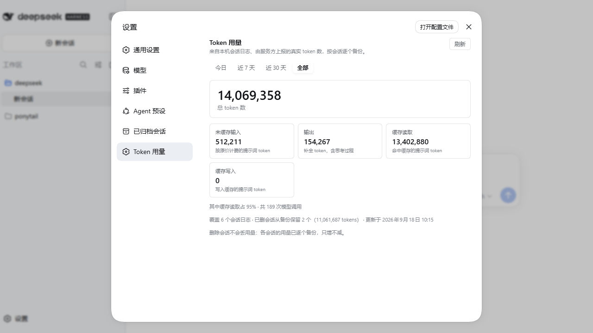

# 验证记录（0.3.0 / 0.3.1）

> **0.3.1 = 0.3.0 + 打包修正，运行时一行没变。**
> 差异只有两处，都在 tarball 的元数据里：去掉 `prepare`（有它的话 pnpm 10+ 会以
> `ERR_PNPM_GIT_DEP_PREPARE_NOT_ALLOWED` 拦下 `github:` 安装，逼用户手改 `allowBuilds`），
> 以及 README 里改成「从本仓库 / 插件市场安装」。`lib/`（宿主半与客户端半的全部代码）
> 与 0.3.0 **逐字节相同** —— 下面这套证据对 0.3.1 同样成立。

本页记录 **0.3.0 是怎么被验证的**：跑了什么、看到什么、以及哪些边界仍然存在。
所有数字都是实测输出，不是推断。

---

## 一、环境

| 项 | 值 |
|---|---|
| dsh | `0.1.6-alpha.1`（`dsh --version`） |
| Node | `24.14.0` |
| pnpm | `12.4.2` |
| 生产环境 | `DSH_HOME=C:\Users\Administrator\.dsh`，`dsh web` 监听 **3080** —— **全程未重启、未改配置、未安装本插件** |
| 隔离环境 | `DSH_HOME=D:\deepseek\.tmp\usage-stats-iso\home`，`dsh web --port 3090` —— 验证结束后整目录删除 |
| 验证日期 | 2026-09-18 |

隔离方式就是 dsh 自己的 `DSH_HOME` 机制（**整个主目录**独立：profile / 插件 / 凭据 / 会话 / 台账），
不是 `--profile`（那只隔离插件树）。两套环境端口不同，可同时运行。

---

## 二、离线套件（任何人可复现，不需要真实会话日志）

```bash
npm test                 # 5 个套件
npm test -- --sessions <会话目录> --reference <解包后的 0.2.0 包目录>
```

| 套件 | 结果 | 覆盖什么 |
|---|---|---|
| `build.mjs --check` | **9/9 文件一致** | `lib/` 与 `src/` 的构建结果逐字节相同（客户端半的外壳与内联都在其中） |
| `verify-fold.mjs` | **28/28** | 11 条折叠规则（每条都比「预期数值」与「0.2.0 参考实现」两遍）+ 4 组合成日志（单帧/三帧/fork/无表头）+ 真实日志 |
| `verify-retention.mjs` | **45/45** | 删除保留、重启保留、追加、日志缩水、台账损坏、台账不可写、根目录不可读、同名 id 重现、后台巡检、确定性 |
| `verify-host.mjs` | **18/18** | HTTP 契约（GET/HEAD/POST、非回环 403、no-store、TTL 缓存共享）+ 真实日志经路由输出 |
| `verify-client.mjs` | **33/33** | ModuleLoader 外壳完整性、无残留模块语法、seat 注册面、以及用真实报告数据渲染出的页面文本（含三种台账状态与 404 重启提示） |

### 2.1 折叠一致性：与**真实的上一个发布产物**比对

参考实现不是重写的，而是**从发布的 tarball 里机器提取**的：

```bash
# dsh-workbuddy-quota-0.2.0.tgz
# sha256 744a39879202782bdbca4d8235094949b73accf7c2f0153841872aed2d2388f8
tar -xzf dsh-workbuddy-quota-0.2.0.tgz
node scripts/verify-fold.mjs --reference ./package --sessions "C:\Users\Administrator\.dsh\sessions"
```

结果：

```none
③ 真实会话日志：C:\Users\Administrator\.dsh\sessions
  ✓ 真实会话日志 35/35 逐字节一致（24045 KiB）
  ✓ 整根目录合并结果一致（35 个会话日志）
通过：28/28 项一致。
```

**35 个真实会话日志、24 MiB，新旧实现的折叠结果逐字节相同** —— 改名与重构没有动用户的数字。
（该步骤只**读**生产会话目录，不写任何东西。）

---

## 三、隔离环境真机验证（3090）

### 3.1 安装与启动

```none
dsh plugin --profile web add D:\deepseek\.tmp\usage-stats-iso\dsh-usage-stats-0.3.0.tgz
  dsh: initialized profile web at D:\deepseek\.tmp\usage-stats-iso\home\profiles\web
  + dsh-usage-stats file:D:/deepseek/.tmp/usage-stats-iso/dsh-usage-stats-0.3.0.tgz
  Done in 65ms using pnpm v12.4.2                    ← 退出码 0
dsh web --port 3090 --no-open
  dsh web: http://127.0.0.1:3090/?token=…            ← 只有这一行，无 plugin tree failed to load / does not export
```

隔离主目录里放了 **7 个真实会话日志**（1.5 MiB，从生产目录**复制**而来，源目录只读）。

### 3.2 删除会话前后（缺陷回归）

| | 删除前 | 删除后（越过 15s 报告 TTL，重新扫描） |
|---|---|---|
| 读到的会话日志 | 6 | **5** |
| 总 tokens | **14,069,358** | **14,069,358**（不变） |
| 模型调用次数 | 189 | 189（不变） |
| 已删除会话保留 | 1 个 / 7,601,885 tokens | **2 个 / 11,061,687 tokens** |
| 台账 | `ok`，7 条记录 | `ok`，7 条记录（**一条都没删**） |

对照：**只折叠仍在磁盘上的日志**（也就是 0.2.0 的口径）此刻只剩 **3,007,671** tokens。
新口径 = 14,069,358，比它多出的 **11,061,687** 正是那两个被删会话的用量。

第一次连跑时故意在 TTL 内取值，得到的仍是删除前的数字（`scannedSessions` 也没变）——
这验证了报告缓存的边界是明确的：**TTL 内是缓存，越过 TTL 才是新扫描**，两者都不丢账。

### 3.3 客户端半真的被应用加载

```none
① 客户端半是否被 carrier 提供
  · /plugins/??dsh-usage-stats/client.js&rev=e9880776d4ae3a9d-51 → HTTP 200 (23635 bytes)
② 应用外壳是否认得这个插件
  · GET / → HTTP 200（预加载清单里出现 dsh-usage-stats/client.js）
③ 宿主半路由 → HTTP 200，报告含 cells 与 backup
④ 旧插件路径 /plugins/dsh-workbuddy-quota/usage → HTTP 404（没有误注册别人的路径）
```

### 3.4 设置页在真实浏览器里的渲染

用 Edge 打开 `http://127.0.0.1:3090/`（隔离实例），进入 **设置 → Token 用量**：



页面文本（`get text body` 实测）：

```none
Token 用量
来自本机会话日志、由服务方上报的真实 token 数，按会话逐个备份。
今日 近 7 天 近 30 天 [全部]
14,069,358  总 token 数
未缓存输入 512,211 · 输出 154,267 · 缓存读取 13,402,880 · 缓存写入 0
其中缓存读取占 95% · 共 189 次模型调用
覆盖 6 个会话日志 · 已删会话从备份保留 2 个（11,061,687 tokens） · 更新于 2026年9月18日 10:15
删除会话不会丢用量：各会话的用量已逐个备份，只增不减。
```

浏览器 console：**没有来自本插件的任何错误**（只有一条与表单有关的 Chromium 提示）。

---

## 四、副作用面（诚实登记）

| 项 | 事实 |
|---|---|
| 网络 | 运行时不发起任何网络请求（无 provider、无遥测） |
| 凭据 | 不读取、不持有 |
| 模型路由 | 不触碰 |
| 写入 | **只写自己那份台账**：`$DSH_HOME/storages/dsh-usage-stats/usage-ledger.json`（原子写：临时文件 + rename）。另有损坏隔离文件 `usage-ledger.json.corrupt.json` |
| 生产环境 | 验证期间只对 `C:\Users\Administrator\.dsh\sessions` 做过**只读**扫描；未安装、未重启、未改配置 |
| 后台进程 | 宿主半每 30 秒巡检一次，定时器 `unref()`，不会拖住进程退出 |
| 卸载 | 不删台账（用量记录由用户决定去留） |

---

## 五、仍未验证 / 已知边界

| 项 | 说明 |
|---|---|
| 删除前 ≤30 秒的用量 | 会话在被折叠之前就被删除时，最后那点用量可能来不及入账。巡检间隔（30s）决定这个窗口 |
| 台账启用之前已删除的会话 | 日志已不存在，任何实现都救不回来；台账从第一次扫描开始积累 |
| 标题生成 | `session/title-llm-request` 花 token 但不记 usage 样本 —— **DSH 自己的投影有同样盲点**，本插件与框架保持一致 |
| 多机/多主目录 | 台账按 `$DSH_HOME` 分开，不跨机合并（同一份统计口径只覆盖一台 harness） |
| 与 `dsh-workbuddy-quota` 同装 | 会出现两个 Token 用量设置页（seat id 不同），建议卸载旧的 |

---

## 六、复现命令速查

```bash
# 1) 源码侧：构建 + 全部离线套件
npm test

# 2) 折叠与真实产物比对（需要 0.2.0 的 tarball）
tar -xzf dsh-workbuddy-quota-0.2.0.tgz
node scripts/verify-fold.mjs --reference ./package --sessions "$DSH_HOME/sessions"

# 3) 隔离真机（不要动生产 3080）
$env:DSH_HOME='<另一个主目录>'
dsh plugin --profile web add <本包 tarball 绝对路径>
dsh web --port 3090 --no-open
# 删除 <另一个主目录>/sessions/<工作区>/<会话 id>/ 之后再看一次用量页
```
